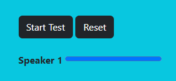

# VoiceJoy Eagle

## Table of Contents
1. [Installation](#installation)
2. [Features](#features)
3. [Getting Started](#getting-started)
4. [Demo](#demo)
5. [Technologies Used](#technologies-used)
6. [License](#license)

## Introduction

Welcome to VoiceJoy Eagle! This project showcases the integration of Picovoice Eagles Web SDK for Web and the WebVoiceProcessor, transforming your voice into an emoji extravaganza! The application recognizes your voice and displays whimsical emojis to express recognition or lack thereof.

## Features

- Integration of Picovoice Eagle for Web
- WebVoiceProcessor for voice recognition
- Emoji feedback

## Getting Started

To start using VoiceJoy Eagle, follow these steps:

1. **Obtain Access Key**: Sign up on the [Picovoice Console](https://console.picovoice.ai/) to obtain an access key.
2. **Start Eagle**: Enter the access key and click on the "Start Eagle" button to initialize the application.
3. **Enroll Speakers**:
   - Option 1: Enroll speakers using audio files by uploading one or more files.
   - Option 2: Enroll speakers using a microphone by clicking on the "Record Audio" button and speaking continuously until enrollment is complete.

4. **Start Testing**: Once speakers are enrolled, click on the "Start Test" button to begin voice recognition testing.
5. **Stop Testing**: Click on the "Stop Test" button to end the testing session.

## Demo

## Technologies Used

- HTML
- CSS
- JavaScript
- Bootstrap
- Picovoice Eagle Web SDK

## Usage

To use this application on your local machine follow the below steps in your terminal:
- `git clone` this repo
- `cd demo/web`
- `npm install`
- `npm run start`

## License

This project is licensed under the [MIT License](LICENSE).
